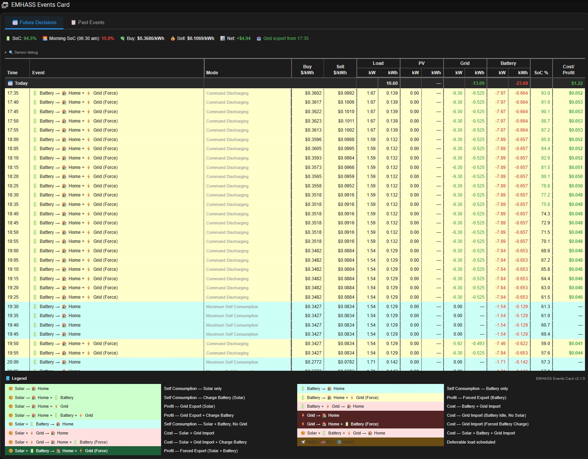
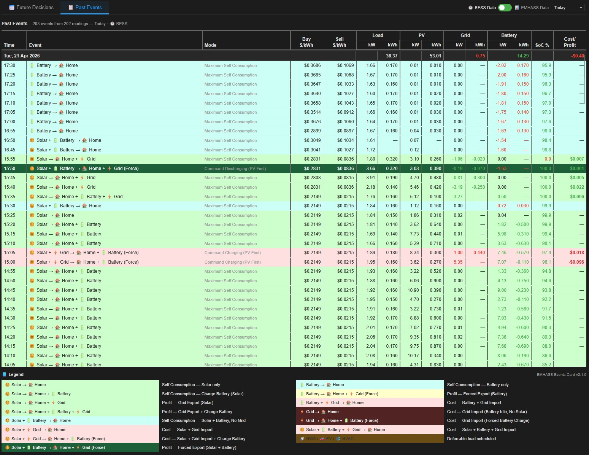

# EMHASS Events Card

A custom Home Assistant Lovelace card for [EMHASS](https://emhass.readthedocs.io/) (Energy Management for Home Assistant) that displays MPC optimizer forecasts and historical energy events in a rich, colour-coded table.

Designed for the **Sigenergy + EMHASS MPC** setup documented at [sigenergy.annable.me](https://sigenergy.annable.me/emhass/), with three-tier sensor fallback so it also works with standard EMHASS installations and in the settings modal you can define your EMHASS and Inverter/Battery sensors if they are different.

---

### Future Decisions



### Past Events



---

## Features

- **📅 Future Decisions tab** — full MPC forecast horizon showing every 5-minute optimization decision
- **📋 Past Events tab** — historical sensor data with configurable lookback (Today, Yesterday, 24h–7 days)
- **🕐 BESS / 📊 EMHASS toggle** — switch between actual inverter data and EMHASS optimizer decisions in the Past tab
- **Colour-coded event rows** — instantly see what the optimizer is doing at each timestep
- **HAEO-style flow labels** — descriptive events like `🌞 Solar → 🏠 Home + 🔋 Battery + ⚡ Grid`
- **Status bar** — current SoC, morning/peak SoC forecast, buy/sell prices, net cost, grid alerts
- **Daily summary rows** — kWh totals per day for Load, PV, Grid and Battery
- **Cost/Profit column** — per-row estimated cost or earnings
- **Three-tier sensor fallback** — card YAML config → MPC/Sigenergy sensors → standard EMHASS sensors
- **Auto-refresh** — updates at :01, :06, :11 ... past each hour to align with MPC optimization cycles
- **Adaptive history rows** — Past tab uses actual recorded timestamps rather than fixed slots, handles sparse history correctly
- **5-minute bucketing** — BESS mode aggregates high-frequency inverter data into 5-minute averages
- **Auto unit detection** — power sensors in W, kW or MW are detected and normalised automatically
- **Sensor debug panel** — expandable diagnostic showing exactly which sensor attributes were found

---

## Requirements

- Home Assistant with a working [EMHASS](https://github.com/davidusb-geek/emhass) installation running `naive-mpc-optim`
- No additional frontend dependencies — pure vanilla JS

---

## Installation

### Manual

1. Copy `emhass-events-card.js` to `/config/www/emhass-events-card.js`
2. In Home Assistant go to **Settings → Dashboards → Resources** and add:
   - URL: `/local/emhass-events-card.js`
   - Type: **JavaScript Module**
3. Hard-refresh your browser (`Ctrl+Shift+R` / `Cmd+Shift+R`)

### HACS (not yet listed)

Manual installation only for now. HACS submission planned.

---

## Basic Usage

```yaml
type: custom:emhass-events-card
grid_options:
  columns: full
  rows: auto
```

That's it for a standard Sigenergy + EMHASS MPC install. The card auto-detects sensors using its three-tier fallback (see below).

---

## Sensor Configuration
---

## Recorder Configuration

For the **Past Events tab** to work, sensors must be recorded by HA. Add the following (or your inverter / power provider pricing sensors details to your `recorder.yaml`:

```yaml
recorder:
  include:
    entity_globs:
      - sensor.mpc_*
      - sensor.sigen_plant_*
      - sensor.amber_express_home_*
```

> **Important:** HA recorder only stores data from when the entity is included — there is no backfill of historical data. The Past tab will show increasing data the longer the sensors have been recorded.

### Why MPC sensors record sparse history

EMHASS MPC sensors only write a new HA state when their value **changes** between optimization runs:

- **Power sensors** (`mpc_batt_power`, `mpc_load_power` etc.) — record a new state each time EMHASS publishes a different value
- **Price sensors** (`mpc_general_price`, `mpc_feed_in_price`) — only change when the spot price moves; can be very sparse
- **SoC sensor** (`mpc_batt_soc`) — only changes when the battery SoC changes between runs

This is why the Past tab uses separate `past_buy_price` / `past_sell_price` sensors pointing to your live tariff feed (e.g. Amber), which record state on every poll.

### BESS mode and high-frequency sensors

Sigenergy sensors update every few seconds, generating thousands of state changes per day. The card automatically aggregates these into 5-minute buckets:
- **Power sensors** — averaged within each bucket
- **SoC and price** — last value in each bucket

Unit detection is automatic — sensors reporting in W, kW or MW are all normalised to W internally.

---

## Sign Conventions

| Sensor type | Positive | Negative |
|---|---|---|
| **MPC battery** (`mpc_batt_power`) | Discharging (SoC falls) | Charging (SoC rises) |
| **BESS battery** (`sigen_plant_battery_power`) | Charging (SoC rises) | Discharging (SoC falls) |
| **Grid** (both modes) | Import (buying) | Export (selling) |
| **PV** (both modes) | Always positive | — |
| **Load** (both modes) | Always positive | — |

The battery column display is normalised regardless of mode:
- Discharging → displayed as `-x.xx kW` in **red**
- Charging → displayed as `x.xx kW` in **green** (no `+` prefix)

---

## Event Classification

Events are classified from the combination of PV, battery, grid and load power at each timestep using a 50W threshold. Events follow HAEO-style flow notation:

### Solar present

| Event label | Colour | Meaning |
|---|---|---|
| `🌞 Solar → 🏠 Home` | 🟡 Yellow-green | Solar self-consumption only |
| `🌞 Solar → 🏠 Home + 🔋 Battery` | 🟡 Yellow-green | Solar charging battery, no grid |
| `🌞 Solar → 🏠 Home + ⚡ Grid` | 🟡 Yellow-green | Solar surplus exported |
| `🌞 Solar → 🏠 Home + 🔋 Battery + ⚡ Grid` | 🟡 Yellow-green | Solar charging battery and exporting |
| `🌞 Solar + 🔋 Battery → 🏠 Home` | 🩵 Teal | Solar + battery, no grid |
| `🌞 Solar + ⚡ Grid → 🏠 Home` | 🔴 Pink-red | Solar insufficient, grid topping up |
| `🌞 Solar + ⚡ Grid → 🏠 Home + 🔋 Battery (Force)` | 🔴 Pink-red | Forced grid charge alongside solar |
| `🌞 Solar + 🔋 Battery + ⚡ Grid → 🏠 Home` | 🔴 Pink-red | All three sources needed |
| `🌞 Solar + 🔋 Battery → 🏠 Home + ⚡ Grid (Force)` | 🟢 Green | Forced export: solar + battery |

### No solar (night / overcast)

| Event label | Colour | Meaning |
|---|---|---|
| `🔋 Battery → 🏠 Home` | 🩵 Teal | Battery powering home, no grid |
| `🔋 Battery → 🏠 Home + ⚡ Grid (Force)` | 🟡 Yellow | Forced battery export to grid |
| `🔋 Battery + ⚡ Grid → 🏠 Home` | 🔴 Pink-red | Battery + grid covering load |
| `⚡ Grid → 🏠 Home` | 🔴 Red | Grid only, battery idle |
| `⚡ Grid → 🏠 Home + 🔋 Battery (Force)` | 🔴 Red | Forced grid charge (cheap rate) |

---

## Modes Column

The Mode column describes the optimizer's inferred control action, derived from power values. Shown in both Future Decisions and Past Events tabs.

| Mode | Description |
|---|---|
| `Maximum Self Consumption` | Prioritising self-use of solar/battery |
| `Command Charging (PV First)` | Forced battery charge — grid import + solar |
| `Command Charging` | Forced battery charge from grid only |
| `Command Discharging (PV First)` | Forced battery discharge to grid with solar |
| `Command Discharging` | Forced battery discharge to grid, no solar |
| `Standby` | Battery idle, no active charging or discharging |

---

## Past Events Tab — BESS / EMHASS Toggle

The Past Events tab has a toggle switch in the header bar:

**`🕐 BESS Data  ⬤○  📊 EMHASS Data`**

| Mode | Data source | Best for |
|---|---|---|
| 🕐 BESS Data | Actual inverter sensors (Sigenergy) — dense 5-min averages | Seeing what physically happened |
| 📊 EMHASS Data | EMHASS MPC optimizer sensor states | Seeing what the optimizer decided |

- **Default:** BESS Data (when BESS sensors are configured)
- If no BESS sensors configured: toggle is disabled, defaults to EMHASS Data

---

## Versioning

| Version | Changes |
|---|---|
| v2.1.5 | Fix BESS unit scaling (kW→W) after bucketing; fix battery kWh sign in BESS vs EMHASS mode |
| v2.1.4 | BESS mode aggregates into 5-min buckets (average power, last SoC/price) |
| v2.1.3 | Fix BESS "No Data" — toggle mode now determined before history API call so correct sensors are requested |
| v2.1.2 | BESS/EMHASS toggle switch in Past tab; BESS actual inverter sensors with separate sign convention handling |
| v2.1.1 | Sigenergy lifetime energy sensors as Tier 2 defaults; Mode column in Past tab |
| v2.1.0 | Fix Past tab power values all zero — exact recorded timestamps used instead of snapped 5-min slots |
| v2.0.9 | Fix Past tab rows all skipped — `_pwrMult` W→kW conversion made values fall below skip threshold |
| v2.0.8 | Past tab uses actual recorded timestamps instead of fixed 5-min slots |
| v2.0.7 | Fix Past tab blank — skip condition incorrectly gated on SoC=0 |
| v2.0.6 | Separate `past_buy_price` / `past_sell_price` sensors — dense Amber history for past cost calculations |
| v2.0.5 | Fix daily Cost/Profit sum sign; add 10W noise floor clamp |
| v2.0.4 | Fix battery daily sum sign and colour in both tabs |
| v2.0.3 | HAEO-style event labels; battery display negated (discharge = -kW red); classifier threshold 50W |
| v2.0.2 | Fix battery sign convention (raw +ve = discharging confirmed by SoC trend) |
| v2.0.1 | Three-tier sensor fallback; auto-detect attribute keys; sensor debug panel |
| v2.0.0 | Initial release — Future Decisions + Past Events tabs, MPC sensor support |

---

## Related Projects

- [EMHASS](https://github.com/davidusb-geek/emhass) — Energy Management for Home Assistant
- [Sigenergy + EMHASS guide](https://sigenergy.annable.me/emhass/) — annable.me setup guide this card is designed for
- [HAEO Events Card](https://github.com/) — the HAEO optimizer card this was modelled on

---

## License

MIT License — see [LICENSE](LICENSE) for details.
