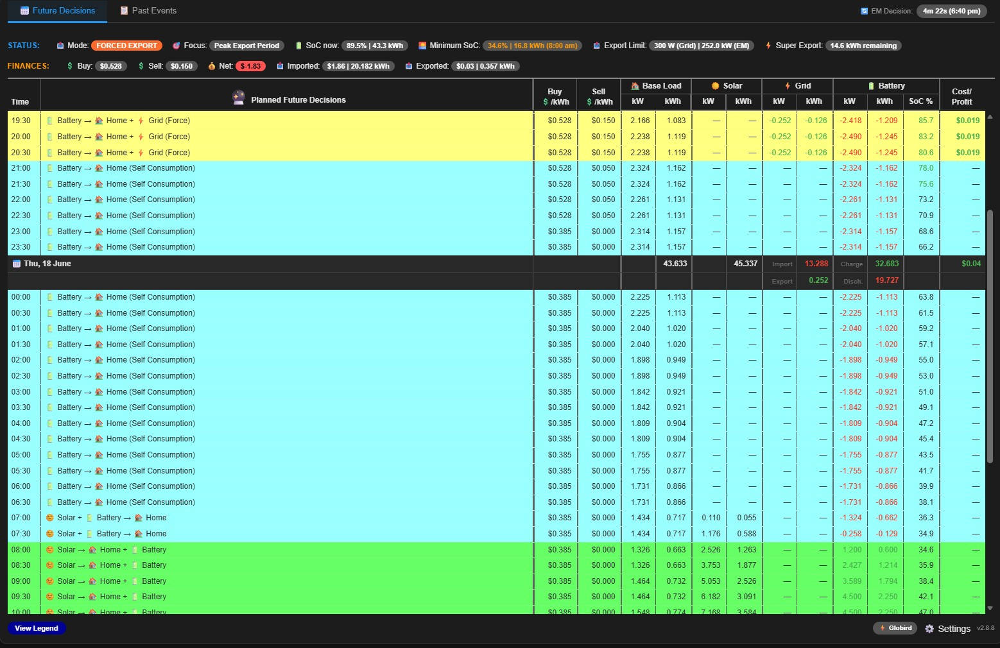
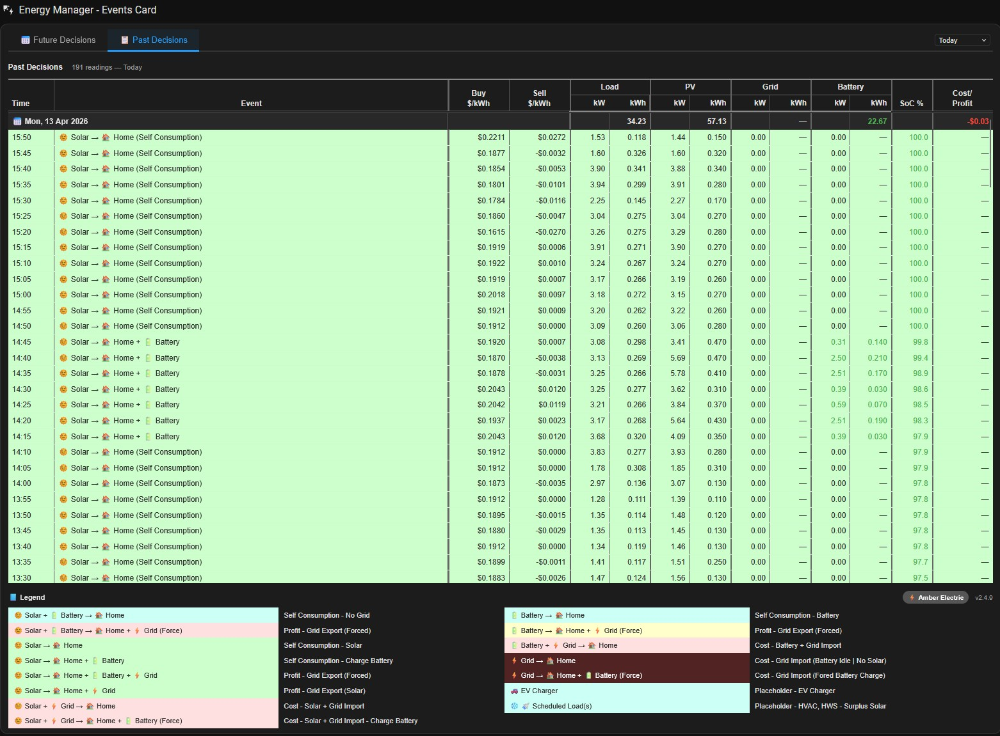

# EM Events Card

A custom Home Assistant card for the **Energy Manager** addon. Displays energy planning decisions in two tabs — **Future Decisions** (forecast timeline) and **Past Decisions** (historical 5-min readings) — in a single scrollable table with fixed headers and a colour-coded legend.

Current version: **v2.4.17**

---

### Future Decisions



### Past Events



---

## Features

- **Future Decisions tab** — reads `sensor.energy_manager_plan` and renders the forecast timeline showing mode, power flows, pricing, SoC and cost/profit per slot
- **Past Decisions tab** — fetches inverter sensor history via WebSocket and renders 5-min historical readings with the same column layout
- Mixed 5-min / 30-min step support in the forecast timeline
- Provider-aware pricing for Amber Electric, LocalVolts, Flow Power and GloBird (including GloBird's super export cap)
- Per-day summary rows showing Load / PV / Grid / Battery kWh totals and Cost/Profit
- Signed and colour-coded Grid kWh (green = export, red = import) and Battery kWh (green = charge, red = discharge)
- Zero kW/kWh values shown as `—` to reduce visual clutter
- **Status bar** showing:
  - Current mode pill
  - Focus pill (e.g. Optimising Self-Use, Export Protection, Grid Charging Expected)
  - SoC now and Morning/Peak SoC
  - Provider-calculated Buy and Sell price pills (correct for all four providers)
  - Contextual Export Limit or Charge Limit pill based on next timeline decision
  - Right-aligned alert pills: Forced Export, Forced Import, Grid Export, Grid Import with colour coding and 12hr times
- Sticky column headers — tabs, status bar and column headers remain fixed while data rows scroll
- Auto-refresh aligned to HA's update boundaries (:01, :06, :11 … past the hour), only when the browser tab is visible
- Two-column legend with colour swatches

---

## Installation

1. Copy `em-events-card.js` to `/config/www/em-events-card.js` on your HA server
2. Add it as a resource in your dashboard:
   - Go to **Settings → Dashboards → Resources**
   - Add `/local/em-events-card.js` as a **JavaScript module**
3. Add the card to your dashboard:

```yaml
type: custom:em-events-card
grid_options:
  columns: full
```

---

## Required Sensors

### Core (all providers)

| Entity | Description |
|--------|-------------|
| `sensor.energy_manager_plan` | Energy Manager forecast plan (attributes) |
| `input_select.electricity_provider` | Selected provider: `Amber Electric`, `LocalVolts`, `Flow Power`, or `GloBird` |
| `sensor.inverter_pv_power` | PV generation power (W) |
| `sensor.inverter_load_power` | Home load power (W) |
| `sensor.inverter_import_power` | Grid import power (W) |
| `sensor.inverter_export_power` | Grid export power (W) |
| `sensor.inverter_battery_charging_power` | Battery charge power (W) |
| `sensor.inverter_battery_discharging_power` | Battery discharge power (W) |
| `sensor.inverter_battery_level` | Battery SoC (%) |
| `sensor.nodered_buyprice` | Current buy price ($/kWh) — Amber/LocalVolts fallback |
| `sensor.nodered_sellprice` | Current sell price ($/kWh) — Amber/LocalVolts fallback |
| `sensor.inverter_current_export_power_limit` | Current export power limit (W) — for Export Limit pill |
| `sensor.inverter_current_max_charge_power` | Current max charge power (W) — for Charge Limit pill |
| `input_number.inverter_import_limit` | Inverter import limit (kW) — for Charge Limit pill |

### Energy kWh sensors (Past Decisions tab)

| Entity | Description |
|--------|-------------|
| `sensor.monthly_imported_energy` | Total increasing grid import (kWh) |
| `sensor.monthly_exported_energy` | Total increasing grid export (kWh) |
| `sensor.monthly_pv_generation` | Total increasing PV generation (kWh) |
| `sensor.monthly_battery_charge` | Total increasing battery charge (kWh) |
| `sensor.monthly_battery_discharge` | Total increasing battery discharge (kWh) |
| `sensor.daily_consumed_energy` | Daily load energy — resets midnight (kWh) |

---

## Provider-Specific Entities

### Amber Electric / LocalVolts
No additional entities required. Prices are read directly from the plan and from `sensor.nodered_buyprice` / `sensor.nodered_sellprice`.

### Flow Power

| Entity | Description |
|--------|-------------|
| `input_number.flowpower_buy_price` | Flat buy price (cents/kWh) |
| `input_number.flowpower_peak_feedin_price` | Peak feed-in price (cents/kWh) |
| `input_number.flowpower_offpeak_feedin_price` | Off-peak feed-in price (cents/kWh) |
| `input_datetime.flowpower_peak_start_time` | Peak export window start |
| `input_datetime.flowpower_peak_end_time` | Peak export window end |

### GloBird

| Entity | Description |
|--------|-------------|
| `input_number.globird_peak_buy_price` | Peak buy price (cents/kWh) |
| `input_number.globird_free_buy_price` | Free period buy price (cents/kWh) |
| `input_number.globird_other_buy_price` | Off-peak buy price (cents/kWh) |
| `input_datetime.globird_peak_buy_start` | Peak buy window start |
| `input_datetime.globird_peak_buy_end` | Peak buy window end |
| `input_datetime.globird_free_buy_start` | Free buy window start |
| `input_datetime.globird_free_buy_end` | Free buy window end |
| `input_number.globird_super_sell` | Super export sell price (cents/kWh) |
| `input_number.globird_std_sell` | Standard sell price (cents/kWh) |
| `input_number.globird_other_sell` | Off-peak sell price (cents/kWh) |
| `input_datetime.globird_super_start` | Super export window start (default 18:00) |
| `input_datetime.globird_super_end` | Super export window end (default 21:00) |
| `input_datetime.globird_std_start` | Standard sell window start |
| `input_datetime.globird_std_end` | Standard sell window end |
| `input_number.globird_super_max_export` | Super export cap (kWh, default 10) |
| `sensor.daily_exported_energy` | Daily exported energy for cap tracking (kWh) |

---

## Optional Card Configuration

```yaml
type: custom:em-events-card
load_energy_sensor: sensor.daily_consumed_energy   # override load kWh sensor
```

---

## Status Bar

The status bar displays the following items left to right:

| Item | Description |
|------|-------------|
| 🏠 Mode | Current operating mode pill — green (Self Consumption), blue (Forced Charge), orange (Forced Export) |
| 🎯 Focus | Optimiser focus pill — e.g. Optimising Self-Use, Export Protection, Grid Charging Expected |
| 🔋 SoC now | Current battery state of charge |
| 🌅 Morning SoC / 🔋 Peak SoC | Forecast SoC at next solar start (morning) or peak charge point |
| 💰 Buy | Provider-calculated current buy price pill |
| 💰 Sell | Provider-calculated current sell price pill |
| 📤 Export Limit | Current export power limit pill — only shown when next decision involves grid export |
| ⚡ Charge Limit | Lesser of max charge power and import limit — only shown when next decision involves grid import or battery charging |

Right-aligned alert pills (shown only when applicable, Forced before Grid):

| Pill | Colour | Meaning |
|------|--------|---------|
| 📤 Forced Export from x:xx | Green (sell > 0) / Orange (sell ≤ 0) | Next forced export event |
| ⚡ Forced Import from x:xx | Green (buy < 0) / Red (buy > 0) | Next forced import event |
| ⚡ Grid Export from x:xx | Green | Next expected grid export |
| ⚠️ Grid Import from x:xx | Orange | Next expected grid import |

---

## Column Layout

| Column | Description |
|--------|-------------|
| Time | Slot time (HH:MM) |
| Event | Energy flow classification with emoji |
| Buy $/kWh | Buy price for the slot |
| Sell $/kWh | Sell price for the slot |
| Load kW / kWh | Home consumption |
| PV kW / kWh | Solar generation |
| Grid kW / kWh | Grid flow — negative (green) = export, positive (red) = import |
| Battery kW / kWh | Battery flow — negative (red) = discharge, positive (green) = charge |
| SoC % | Battery state of charge — red ≤ 20%, green ≥ 75% |
| Cost/Profit | Slot cost/profit — green = profit, red = cost |

Day header rows show totals for Load, PV, Grid and Battery kWh, plus the day's total Cost/Profit. Grid and Battery totals are colour-coded by net direction.

---

## Colour Legend

| Colour | Meaning |
|--------|---------|
| 🟩 Light green (`#ccffcc`) | Solar self-consumption — charging battery or covering home |
| 🟦 Teal (`#ccfff5`) | Solar + battery covering home — no grid |
| 🟨 Yellow (`#ffffcc`) | Battery forced discharge to grid |
| 🟥 Light red (`#ffe0e0`) | Solar + grid, or forced export |
| 🟥 Dark red (`rgba(180,50,50,0.35)`) | Grid import — battery idle or forced charge |
| 🟩 Dark green (`rgba(30,150,80,0.55)`) | *(reserved)* |

---

## Supported Electricity Providers

| Provider | Buy pricing | Sell pricing | Notes |
|----------|-------------|--------------|-------|
| Amber Electric | From plan | From plan | Dynamic spot pricing |
| LocalVolts | From plan | From plan | Dynamic spot pricing |
| Flow Power | Flat rate | Time-banded peak/off-peak | |
| GloBird | Time-banded peak/free/other | Super/standard/other with daily export cap | ZeroHero super export cap tracked via `sensor.daily_exported_energy` |

---

## Auto-Refresh

The card automatically refreshes at 1, 6, 11, 16, 21, 26, 31, 36, 41, 46, 51 and 56 minutes past the hour — aligned to HA's ~5-minute update cycle with a 1-minute buffer. Refreshes are skipped when the browser tab is hidden and catch up immediately when the tab becomes visible again.

---

## Known Limitations

- **DST changeover**: duplicate 02:00/02:30 rows appear in the Past tab on the night clocks change back — this is expected behaviour
- **GloBird super export cap**: applied to Future tab using `sensor.daily_exported_energy` as the daily baseline; Past tab reads the sensor directly from history
- **Past tab kWh accuracy**: kWh values in the Past tab are deltas from `total_increasing` energy sensors and may show `—` for slots where the power reading is below 50W (sensor rounding suppression)

---

## Versioning

`v[major].[minor].[patch]` — patch = minor fix, minor = medium update, major = rewrite. Version is displayed in the legend footer.

See [CHANGELOG.md](./CHANGELOG.md) for full version history.
