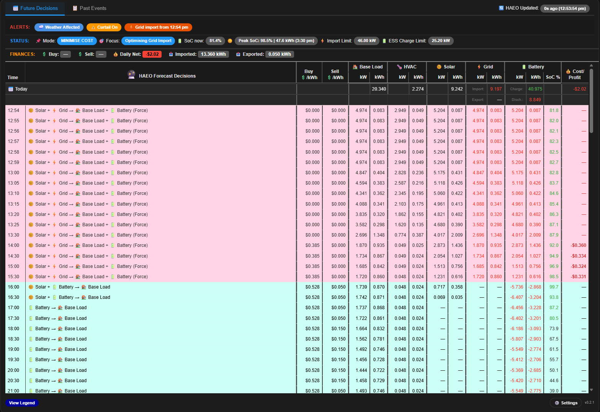
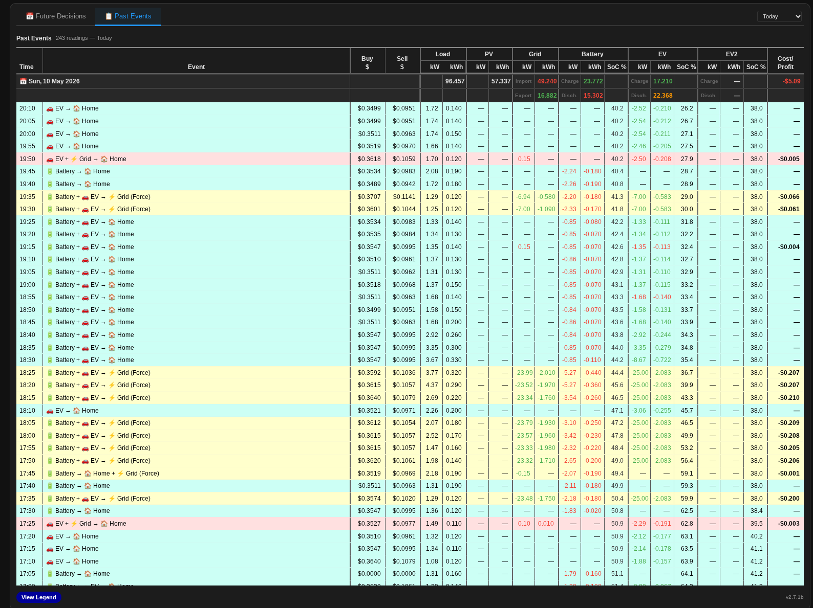
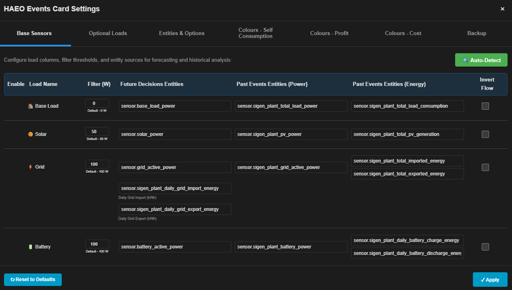
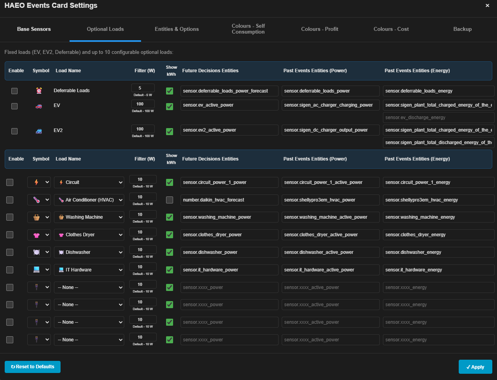
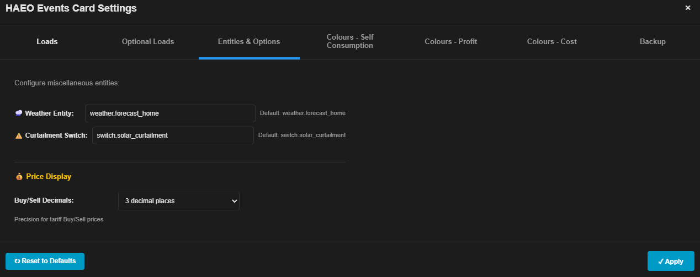
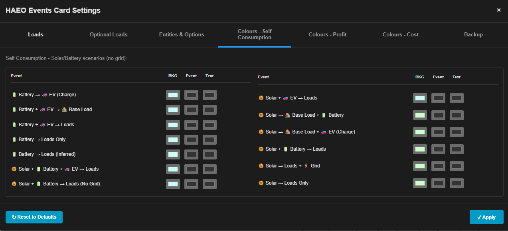
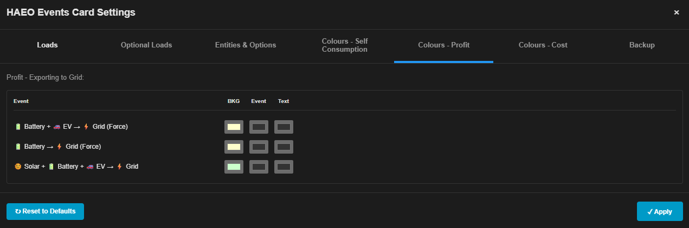
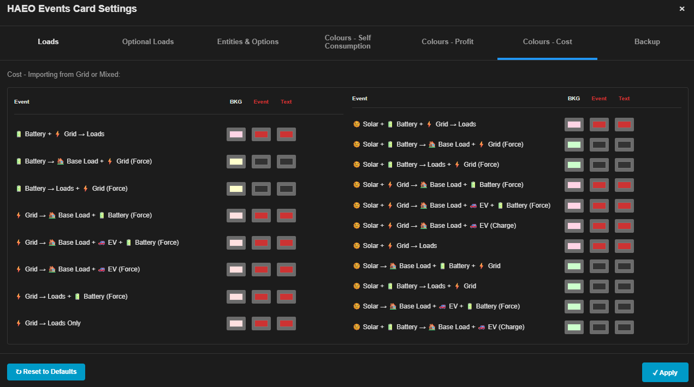
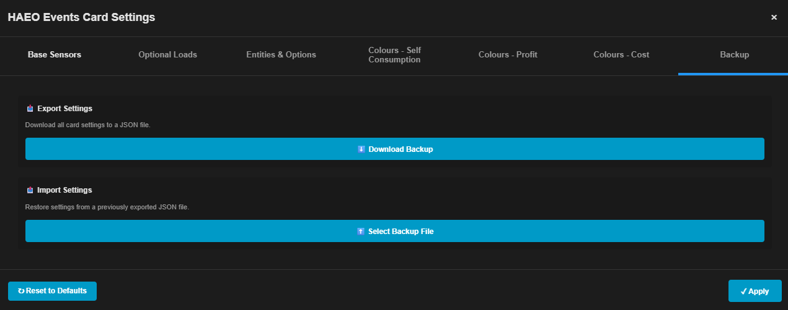

# HAEO Events Card (`haeo-events-card.js`)

A custom Home Assistant Lovelace card for the **Home Assistant Energy Optimiser (HAEO)** integration. Displays the optimizer's forecast decisions in a **Future Decisions** tab and your inverter's actual historical sensor readings in a **Past Events** tab — both in a single, scrollable table with grouped kW and kWh columns.

**Current version:** `v3.2.69`

---

### Future Decisions



### Past Events



---

## Features

- **Future Decisions tab** — shows the HAEO optimizer's forecast for the next several days, reading directly from the `forecast` attributes on your HAEO sensors. Includes:
  - Event classification across 35 distinct scenarios (Solar → Home, Battery → Home, Grid charging, Force Export, EV combinations, etc.)
  - **Mode & Focus status pills** — auto-derived "SELF CONSUMPTION", "MAXIMISE PROFIT", or "MINIMISE COST" mode badge with a matching focus description, colour-coded to the current classification
  - **🔄 HAEO Updated badge** — shows how long ago the optimizer last ran (from `sensor.optimizer_status`'s `last_run` attribute), centred in the tab bar
  - **Power limit pills** — Export Limit, Import Limit, ESS Charge Limit and ESS Discharge Limit badges appear in the status bar when the corresponding `number.*` entity is available and relevant (e.g. Import Limit only shows while actually importing)
  - **Smart alert pills** — Weather Affected, Curtail On, next Grid Import/Export window, and next Force Charge/Discharge window, each with a 12h time (and day name if not today)
  - Buy and Sell price per slot (configurable decimal precision: 2–5 places)
  - Load, PV, Grid and Battery kW and kWh columns (independently configurable decimal precision: 1–4 places)
  - SoC % with colour warnings at low levels, plus optional kWh-equivalent display when a battery capacity (`number.battery_capacity`) entity is configured
  - 💰 Cost/Profit per slot and daily totals — calculated from per-slot deltas of `sensor.grid_net_cost`
  - 📊 FINANCES bar: Daily Buy/Sell prices, Daily Net (cost/credit), Imported/Exported energy totals
  - Status bar: SoC now, Morning/Peak SoC, current buy/sell prices, colour-coded grid import/export pill badges with 12h times
  - Smart auto-refresh timed to HA's 5-minute update boundary

- **Past Events tab** — reads actual inverter sensor history from the HA recorder, aligned to 5-minute slots. Uses real inverter power measurements (not HAEO planned values) for accurate event classification. Includes:
  - Event classification from actual inverter power readings
  - kWh delta columns from `total_increasing` energy sensors, with fallback estimation when sensor data is unavailable
  - Daily kWh totals (Load, PV, Grid, Battery) and daily 💰 Cost/Profit
  - Range selector: Today / Yesterday / Last 24h / 48h / 72h / 96h / 7 days
  - Auto-switches to Last 24h if Today has no data yet

- **Colour coding** — row backgrounds reflect the event type; kW/kWh values are individually coloured:
  - Grid: export = green (earning), import = red (costing)
  - Battery: charging from solar = green, charging from grid = amber, discharging = red
  - Values below display threshold (±100W grid/battery, 50W PV) show as `—` in default text colour

- **Settings Modal** — intuitive configuration interface accessible via the ⚙️ icon:
  - **Base Sensors tab** — configure HAEO and inverter sensor entities, plus deferrable load monitoring (formerly "Loads")
  - **Optional Loads tab** — enable/disable and name optional load entities
  - **Entities & Options tab** — configure all sensors, weather entity, curtailment switch, and display options (no YAML required)
  - **Colours - Self Consumption / Profit / Cost tabs** — customize row background and text colours per event category
  - **Backup tab** — export/import settings as JSON

- **Display Options** (in Entities & Options tab):
  - Buy/Sell price decimal places: 2, 3, 4 (default), or 5
  - kW value decimal places: 1–4 (default 3)
  - kWh value decimal places: 1–4 (default 3)
  - Weather entity (for the Weather Affected alert pill)
  - Curtailment switch entity (for the Curtail On alert pill)
  - Daily Grid Import/Export sensor configuration

- **Two sensor groups** — Future tab uses HAEO optimizer sensors (forecast attributes); Past tab uses inverter power sensors (actual measurements). Both groups are fully configurable via the Settings modal.

- **Auto unit detection** — reads `unit_of_measurement` from live sensor state and normalises to kW / kWh automatically (supports W, kW, MW, Wh, kWh, MWh, GWh)

- **Reliability** — Shadow DOM rebuild detection resets Past tab state on dashboard navigation; stuck-loading recovery retries after 30 seconds if a WebSocket call silently fails

- **Full-width layout** — designed for HA Sections dashboard with `grid_options: columns: full`

---

## Requirements

- Home Assistant with the [HAEO (Home Assistant Energy Optimiser)](https://github.com/energypatrikf/home-assistant-energy-optimizer) integration installed and running
- An inverter integration providing real-time power sensors and `total_increasing` energy sensors (Sigenergy Local Modbus defaults provided; any integration can be configured)
- HA recorder enabled (for Past Events history queries)
- Optional: `sensor.optimizer_status` (with a `last_run` attribute) to power the "HAEO Updated" freshness badge
- Optional: `number.battery_capacity`, and any of `number.grid_export_limit`, `number.grid_import_limit`, `number.battery_max_charge_power`, `number.battery_max_discharge_power` to enable the SoC kWh display and power limit pills

---

## HACS Installation (Preferred)

    In Home Assistant open HACS → Frontend
    Click the ⋮ menu → Custom repositories
    Add https://github.com/Roving-Ronin/ems-events-cards with category Dashboard
    Search for Energy Management Systems - Events Cards and click Download
    Hard-refresh your browser (Ctrl+Shift+R / Cmd+Shift+R)

All three card types will be available immediately — add whichever you need to your dashboard.

---

## Manual Installation

1. Copy `haeo-events-card.js` to your HA config directory:
   ```
   /config/www/haeo-events-card.js
   ```

2. Add it as a Lovelace resource. In HA go to **Settings → Dashboards → ⋮ → Manage resources** and add:
   - **URL:** `/local/haeo-events-card.js`
   - **Type:** JavaScript module

   Or add it manually to your `configuration.yaml` / `ui-lovelace.yaml`:
   ```yaml
   resources:
     - url: /local/haeo-events-card.js
       type: module
   ```

3. Hard-refresh your browser (`Ctrl+Shift+R` / `Cmd+Shift+R`) to load the new resource.

---

## Basic Usage

The simplest configuration — uses all HAEO default sensor names and Sigenergy Local Modbus defaults:

```yaml
type: custom:haeo-events-card
grid_options:
  columns: full
```

All sensor configuration can be done via the Settings modal (⚙️ icon). No YAML sensor configuration is required.

---

## Configuration via Settings Modal

Click the **⚙️** icon in the top-right of the card to open the Settings modal. All sensor entities, display options, and colour customization are configurable without editing YAML.

### Base Sensors Tab



Configure **sensor entities** in one place:

**HAEO Sensors (Future tab — forecast data):**
- Battery Active Power (kW)
- Grid Active Power (kW)
- Load Power (kW)
- Solar Power (kW)
- Battery SoC (%)
- Grid Import Price ($/kWh)
- Grid Export Price ($/kWh)
- Grid Net Cost (cumulative $)
- Grid Export Limit, Grid Import Limit (kW) — optional, drives the status bar limit pills
- Battery Max Charge / Max Discharge Power (kW) — optional, drives the ESS limit pills

**Inverter Power Sensors (Past tab — actual measurements):**
- Battery Power (kW)
- Load Power (kW)
- Solar Power (kW)
- Grid Power (kW)

**Inverter Energy Sensors (Past tab — kWh history):**
- Load Energy (Lifetime total kWh)
- Solar Energy (Lifetime total kWh)
- Grid Import Energy (Lifetime total kWh)
- Grid Export Energy (Lifetime total kWh)
- Battery Charge Energy (Daily kWh)
- Battery Discharge Energy (Daily kWh)

**Daily Grid Sensors (Finances bar):**
- Daily Grid Import Energy (today's total import in kWh)
- Daily Grid Export Energy (today's total export in kWh)

Configure which **deferrable loads** to monitor and display in the card:
- Enable/disable EV and EV2 columns for one or two EV car deferred load monitoring
- **Deferred Load Entity** — single toggle switch controlling when a load can be deferred
- Enable/disable columns for deferred load monitoring
- Each enabled load gets its own **kW/kWh column pair** in the table
- Deferred loads show only when the optimizer decides to defer them (when threshold exceeded)

Use this tab for loads that can be shifted in time (e.g., EV charging, water heater, pool pump) — the optimizer will defer them to windows when solar generation is high or tariffs are low. Use this if you only have a single deferrable load or group all of your deferrable loads into a single group; if you want to individually track deferrable loads, use the 'Optional Loads' feature.

### Optional Loads Tab



Enable/disable and name **individual optional load entities**. Each enabled load gets its own **kW/kWh column pair** in the table.

- Add/enable optional loads by entity ID
- Give each a display name (e.g., "Hot Water", "Pool Pump", "Car Charger")
- Optional loads show in the table whenever they're active
- Supports multiple optional loads — each with independent monitoring

If you configure these loads in HAEO as loads that can be curtailed, the optimizer will factor them into its scheduling decisions. Use this tab to **monitor those loads visually in the card** and track their contribution to the daily energy and cost calculations. Separate from the base load and deferred loads, allowing you to see their individual impact on the forecast and actual energy usage.

### Entities & Options Tab



Configure **sensor entities** and **display options** in one place:

**Miscellaneous:**
- **Weather Entity** — drives the 🌧️ Weather Affected alert pill when conditions are rainy, pouring, cloudy, fog, or partly cloudy (optional)
- **Curtailment Switch** — drives the ⚠️ Curtail On alert pill when the switch is on (optional)

**💰 Price & Value Display Options:**
- **Buy/Sell Decimal Places** — controls precision for tariff prices: 2, 3, 4 (default), or 5 decimal places. Applies to Buy/Sell columns in both Future and Past tabs, and the FINANCES bar
- **kW Decimal Places** — controls precision for Load/PV/Grid/Battery kW columns: 1–4 decimal places (default 3)
- **kWh Decimal Places** — controls precision for Load/PV/Grid/Battery kWh columns: 1–4 decimal places (default 3)

All fields have sensible defaults for the **Sigenergy Local Modbus** integration. Override any field to support other inverter integrations. Changes save automatically to browser localStorage.

### Colours - Self Consumption Tab



Customize row background and text colours for **self-consumption events** (solar covering home, battery discharging, no grid):

- **Row Background Colour** — full-row background when self-consumption occurs
- **Event Text Colour** — colour of the event label text
- Use light green or teal tones to visually distinguish profitable/neutral periods

Examples: 🌞 Solar → Home, 🔋 Battery → Home, Solar + Battery scenarios.

### Colours - Profit Tab



Customize row background and text colours for **profit events** (grid export at peak tariff):

- **Row Background Colour** — full-row background when exporting to grid
- **Event Text Colour** — colour of the event label text
- Use dark green or bright green to visually highlight earning periods

Examples: Forced battery discharge to grid, solar export scenarios, EV discharge to grid.

### Colours - Cost Tab



Customize row background and text colours for **cost events** (grid import at any tariff, forced battery charge):

- **Row Background Colour** — full-row background when importing from grid
- **Event Text Colour** — colour of the event label text
- Use red, orange, or yellow tones to visually highlight cost periods

Examples: Grid import, forced battery charge from grid, grid import + load scenarios.

### Backup Tab



**Export** your card settings as JSON for backup or sharing:
- Click "Export Settings" to download a `.json` file with all your configuration
- Share the file with others or save for safekeeping

**Import** previously saved settings:
- Click "Import Settings" and select a `.json` file
- All configuration is restored (sensor entities, colours, display options, load settings)

Useful for:
- Backing up your configuration before making changes
- Sharing optimal settings with other Home Assistant users
- Restoring settings after clearing browser data/localStorage

---

## Column Reference

| Column | Description |
|---|---|
| Time | Slot start time |
| Event | Classified activity label |
| Buy 💲/kWh | Grid import price for this slot (decimal places configurable: 2-5) |
| Sell 💲/kWh | Grid export price for this slot (decimal places configurable: 2-5) |
| Load kW / kWh | Home consumption — always positive |
| PV kW / kWh | Solar generation — `—` below 50W |
| Grid kW / kWh | Positive = import (red), Negative = export (green) — `—` below 100W |
| Battery kW / kWh | Negative = discharging (red), Positive = charging (green/amber) — `—` below 100W |
| SoC % | Battery state of charge (optionally shown with kWh equivalent if battery capacity is configured) |
| 💰 Cost/Profit | Net grid cost (`-$` = expense, `$` = earning) — `—` when no grid activity |

Day header rows show daily kWh totals for each column and the net cost/profit for the day.

---

## Status Bar & Alert Pills

The status bar above the table (Future Decisions tab only) shows, left to right when applicable:

- **📌 Mode** — SELF CONSUMPTION (green), MAXIMISE PROFIT (orange), or MINIMISE COST (blue), derived from the current slot's classification
- **🎯 Focus** — a short description matching the current mode (e.g. "Optimising Grid Export")
- **🔋 SoC now** — current battery state of charge
- **☀️ Morning/Peak SoC** — projected minimum SoC overnight, or current peak, depending on time of day
- **📤 Export Limit / ⚡ Import Limit** — shown only while the corresponding grid flow is active and a limit entity is configured
- **🔋 ESS Charge Limit / ESS Disch. Limit** — shown only while the battery is charging/discharging and a limit entity is configured

A separate alert row (ALERTS:) surfaces, in priority order:

1. 🌧️ Weather Affected (if the configured weather entity reports rainy/pouring/cloudy/fog/partly_cloudy)
2. ⚠️ Curtail On (if the configured curtailment switch is on)
3. ⚡ Grid import from `<time>` — next forecast grid import window
4. 💲 Grid export from `<time>` — next forecast grid export window
5. 🔋 Force charge from `<time>` — next forecast grid-driven battery charge window
6. 🔋 Force discharge from `<time>` — next forecast battery-to-grid export window

The 🔄 HAEO Updated badge, centred between the tabs, shows how long ago the optimizer last ran (sourced from `sensor.optimizer_status`'s `last_run` attribute).

---

## FINANCES Bar

Located at the top of the Future Decisions tab, the **FINANCES bar** provides a daily summary:

- **Buy / Sell** — current tariff prices (precision: 2-5 decimal places, configurable)
- **Daily Net** — net cost (red) or credit (green) for the day
- **Imported / Exported** — daily grid energy totals in kWh (optional: shows cost/credit if available from actual tariff data)

---

## Event Classification

### Future Decisions

Events are classified from HAEO's forecast power values. HAEO does not expose a mode field, so classification is based purely on the forecast kW values for battery, grid, solar and load. A 50 W (0.05 kW) deadband threshold is used to ignore near-zero values.

### Past Events

Events are classified from actual inverter sensor readings (not HAEO planned values). A 100 W (0.10 kW) threshold is used to filter inverter noise in recorded history. Note that the Past Events tab shows what the inverter physically measured — this may occasionally differ from what HAEO planned if the optimizer's instructions were not followed exactly.

### Event Colour Reference

| Row colour | Meaning |
|---|---|
| 🟢 Light green | Solar self-consumption — solar covering home load |
| 🩵 Teal | Solar + battery self-consumption — no grid |
| 🟡 Yellow | Battery-only or mixed battery/grid |
| 🔴 Dark red | Grid import or forced grid charge — cost incurred |
| 🟩 Dark green | Forced export to grid — profit earned |
| 🌸 Light red | Mixed sources including grid import |

### Full Event List (35 Total Events)

Events are now identified by structured classification keys (e.g. `pv_to_baseload_battery`) which map to display labels and colours independently — useful if you're customizing colours in the Settings modal or reading classification output directly.

**Solar Self-Consumption (Solar covering home, battery charging, or grid export):**

| Event | Description |
|---|---|
| 🌞 Solar → 🏠 Base Load | Solar supplying home load only. Battery idle, no grid. Optimal self-consumption. |
| 🌞 Solar → 🏠 Base Load + 🔋 Battery | Solar supplying home and charging battery. No grid activity. |
| 🌞 Solar + 🔋 Battery → 🏠 Base Load | Solar and battery together supplying home. Battery discharging to supplement. |
| 🌞 Solar → 🏠 Base Load + ⚡ Grid | Solar supplying home with surplus exported to grid. Battery idle. |
| 🌞 Solar → 🏠 Base Load + 🔋 Battery + ⚡ Grid | Solar supplying home, charging battery, and exporting surplus to grid. |
| 🌞 Solar + 🔋 Battery → 🏠 Base Load + ⚡ Grid | Solar and battery supplying home with remaining power exported. |
| 🌞 Solar → 🏠 Base Load + ⚡ Grid + 🔋 Battery (Force) | Solar covering home, charging battery, and exporting at scheduled time. |
| 🌞 Solar + ⚡ Grid → 🏠 Base Load | Solar with grid supplement. Solar alone insufficient. |
| 🔋 Battery + ⚡ Grid → Loads | Battery and grid together covering loads. High demand scenario. |

**Solar + EV Scenarios:**

| Event | Description |
|---|---|
| 🌞 Solar → 🏠 Base Load + 🚗 EV | Solar supplying home and charging EV. Pure solar-to-load and solar-to-EV. |
| 🌞 Solar + 🔋 Battery → 🏠 Base Load + 🚗 EV (Charge) | Solar and battery supplying home and charging EV. No grid. |
| 🌞 Solar + ⚡ Grid → 🏠 Base Load + 🚗 EV (Charge) | Solar and grid together covering home and EV charging. |
| 🌞 Solar → 🏠 Base Load + 🚗 EV + 🔋 Battery (Force) | Solar supplying home, charging EV and battery at low tariff. |
| 🌞 Solar + ⚡ Grid → 🏠 Base Load + 🚗 EV + 🔋 Battery (Force) | Solar with grid supplement covering home, EV, and force-charging battery. |
| 🌞 Solar + 🔋 Battery → Loads (No Grid) | Solar and battery supplying all loads with no grid. Pure self-consumption. |
| 🌞 Solar + 🔋 Battery + ⚡ Grid → Loads | Solar, battery and grid together covering loads. |
| 🌞 Solar + 🚗 EV → Loads | Solar and EV together covering loads. |

**Grid Import (Cost - Forced Battery/EV Charge):**

| Event | Description |
|---|---|
| ⚡ Grid → Loads Only | Grid supplying loads only. Battery idle. Off-peak tariff or no solar. |
| ⚡ Grid → 🏠 Base Load + 🔋 Battery (Force) | Grid supplying home and force-charging battery at low tariff rate. |
| ⚡ Grid → 🏠 Base Load + 🚗 EV (Force) | Grid supplying home and charging EV at low tariff rate. |
| ⚡ Grid → 🏠 Base Load + 🔋 Battery + 🚗 EV (Force) | Grid supplying home, charging battery, and EV all at low tariff. |
| ⚡ Grid → Loads + 🔋 Battery (Force) | Grid covering loads and force-charging battery at low tariff. |
| ⚡ Grid → 🏠 Base Load + 🚗 EV + 🔋 Battery (Force) | Grid covering home and force-charging both EV and battery at low tariff. |
| 🌞 Solar + ⚡ Grid → 🏠 Base Load + 🔋 Battery (Force) | Solar with grid supplement covering home while force-charging battery. |
| 🌞 Solar + ⚡ Grid → 🏠 Base Load + 🚗 EV + 🔋 Battery (Force) | Solar with grid supplement covering home, EV, and force-charging battery. |
| 🌞 Solar + ⚡ Grid → Loads | Solar with grid supplement covering loads. |

**Grid Export (Profit - Forced Battery/EV Discharge):**

| Event | Description |
|---|---|
| 🔋 Battery → ⚡ Grid (Force) | Battery discharging and force-exporting to grid at peak tariff. |
| 🔋 Battery → 🏠 Base Load + ⚡ Grid (Force) | Battery discharging to cover home and force-export to grid at peak tariff. |
| 🌞 Solar + 🔋 Battery → 🏠 Base Load + ⚡ Grid (Force) | Solar and battery covering home with forced battery export at peak tariff. |
| 🔋 Battery → Loads + ⚡ Grid (Force) | Battery covering loads with remainder force-exported to grid. |
| 🔋 Battery + 🚗 EV → ⚡ Grid (Force) | Battery and EV both discharging to grid at high tariff. EV as flexible storage. |
| 🌞 Solar + 🔋 Battery + 🚗 EV → ⚡ Grid | Solar, battery, and EV all exporting to grid simultaneously at peak tariff. |

**Battery Scenarios (No Solar, No Grid):**

| Event | Description |
|---|---|
| 🔋 Battery → Loads Only | Battery powering loads only. No solar, no grid. Battery will deplete. |
| 🔋 Battery → Loads (Inferred) | Battery covering loads, inferred from incomplete sensor data. |
| 🔋 Battery → 🚗 EV (Charge) | Battery charging EV only. Pure battery-to-vehicle transfer. |

**EV Scenarios:**

| Event | Description |
|---|---|
| 🔋 Battery + 🚗 EV → 🏠 Base Load | Battery and EV both discharging to cover home. No solar or grid. |
| 🔋 Battery + 🚗 EV → Loads | Battery and EV both discharging to cover loads. No solar or grid. |
| 🌞 Solar + 🔋 Battery + 🚗 EV → Loads | Solar, battery, and EV together supplying loads. All sources optimized. |

---

## Notes

- **Auto-refresh** — the card watches the optimizer's battery sensor (`last_changed` timestamp) and refreshes automatically when the sensor state updates. This ensures the Future Decisions tab reflects the latest optimizer forecast
- **Cost/Profit (Future tab)** — `sensor.grid_net_cost` is a cumulative running total; the card computes per-slot deltas (`value[i] - value[i-1]`) for accurate per-row and daily totals. Only shown when grid flow exceeds 0.05 kW
- **Cost/Profit (Past tab)** — calculated from grid kW × buy/sell price × slot duration; only shown when grid flow exceeds 0.10 kW
- **Display thresholds** — Grid and Battery kW/kWh values below the configured threshold show as `—`. Thresholds are configurable in Settings → Base Sensors tab:
  - **Load:** default 0W (always shows)
  - **Grid:** default ±100W (configurable, suppresses inverter noise)
  - **Battery:** default ±100W (configurable, suppresses inverter noise)
  - **Deferred Load:** default 50W (configurable)
  - **Optional Loads:** default 10W (configurable per load)
  
  These thresholds suppress sensor noise without affecting event classification logic
- **Unit detection** — `unit_of_measurement` is read from each sensor's live state and values are normalised automatically. Supported units: W / kW / MW (power) and Wh / kWh / MWh / GWh (energy). A browser console warning is logged if a power value exceeds 500 kW after conversion, which may indicate a misconfigured sensor
- **Past Events accuracy** — the Past tab reads inverter sensor history recorded by HA. Classification accuracy depends on how frequently your inverter sensors update and whether HA's recorder captures each 5-minute slot. Values shown are real measurements, not HAEO's planned decisions
- **Dashboard type** — designed for the HA **Sections** dashboard with `grid_options: columns: full`
- **Settings persistence** — all Settings modal changes are automatically saved to browser localStorage under `haeo-events-card-` keys and persist across browser sessions and HA restarts
- **Currency auto-detection** — the card automatically detects your HA currency setting and displays prices with the correct symbol. Can be overridden via YAML `currency_symbol` setting

---

## Troubleshooting

### Card not loading?
- If you also have the Genergy integration loaded, it also contains a version of this card. To update it to the latest version and use that instance and avoid needing to register the javascript in 'Dashboard --> Resources', simply copy the latest version of the card to: /homeassistant/custom_components/genergy_dashboard/frontend

### Settings not saving?
- Check that your browser allows localStorage (not in private/incognito mode)
- Hard-refresh the page (`Ctrl+Shift+R` / `Cmd+Shift+R`)
- Open browser DevTools (F12) and check the Console tab for errors

### Prices or kW/kWh values showing wrong decimal places?
- Open Settings → Entities & Options → Price & Value Display
- Verify the "Buy/Sell Decimals", "kW Decimals", and "kWh Decimals" dropdowns are set correctly
- Hard-refresh the page

### Sensors not found in Settings?
- Verify the entity IDs exist in your HA instance (Settings → Devices & Services → Entities)
- Check that the entity is not disabled
- Verify the entity's `unit_of_measurement` is set correctly (W/kW for power, Wh/kWh for energy)

### Status bar limit pills or HAEO Updated badge not showing?
- Limit pills (Export/Import/ESS Charge/ESS Discharge) only appear when the relevant `number.*` entity is configured in Settings → Base Sensors and the corresponding grid/battery flow is currently active
- The HAEO Updated badge requires `sensor.optimizer_status` to exist with a `last_run` attribute

---

## Related

- [HAEO Integration](https://github.com/energypatrikf/home-assistant-energy-optimizer)
- [Sigenergy Local Modbus Integration](https://github.com/TypQxQ/Sigenergy-Local-Modbus)
- [Energy Manager Card](../EM) — equivalent card for the EMHASS energy manager
